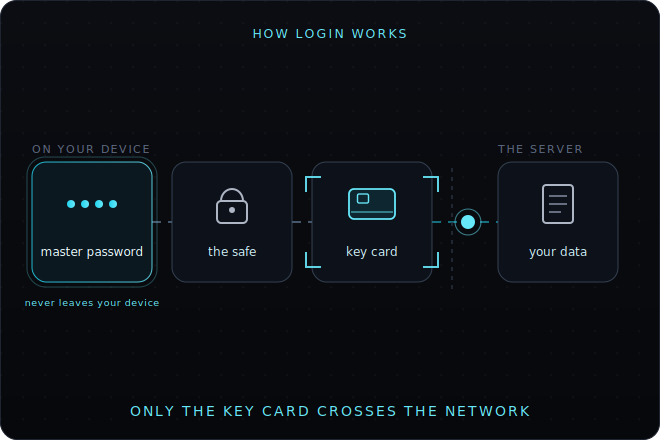

# How login works (in plain words)

When you sign in, where does your password go, and what actually talks to the server?
Here's the whole thing without any jargon.



> **Step-by-step (animated):** see `public/diagrams/login-steps-demo.html` for the looping
> walkthrough — type password → opens the safe → key card → crosses the network → read & write.
> The poster below is the GitHub / no-JS frame.

---

## The one thing to remember

**Your master password never leaves your device.**

It isn't sent anywhere — not to a server, not over the internet. It only opens something
that's already on your own computer.

---

## Think of a safe

Picture a **safe** in your house:

1. **Your master password** is the combination. You open the safe _at home_. The combination
   never goes anywhere.
2. **Inside the safe** is a **key card**.
3. **The key card** is what you swipe at the server's door to get in.

So the order is: your password opens the safe → you take out the key card → the key card opens
your data on the server.

If someone were watching your internet connection, they'd only ever see the key card being
used. They'd never see your password, because it never travels.

---


## Step by step

```
   You type your master password
            │
            ▼
   It opens your "safe"  ← a small locked file, kept on your own device
            │
            ▼
   Inside is a key card  ← created once, the first time you signed in
            │
            ▼
   The key card gets you a short-lived pass to the server
            │
            ▼
   Now you can read and write your own data
```

That's it. The password opens the safe; the key card does the talking.

---

## Where did the key card come from?

The very first time you signed in, you gave an email and password to the server. That was used
**once** to ask the server for a key card — and then it was thrown away.

After that, you never type the email or password again. You just open your safe with your master
password, and the key card inside does the rest.

---

## Two ways you might be signed in

- **You came back and your safe is still open** (same session) → you're straight in, no typing.
- **Your safe locked itself** (after a refresh or some time away) → you type your master password
  once to reopen it. No re-typing email, no being bounced to another page.
- **First time ever** → the full first-time sign-in that creates your safe and your key card.

There's also an older, simpler style where the server sends you to its own sign-in page. The shell
checks for that first, then falls back to your safe.

---

## Why it's built this way

- **Your password can't leak online**, because it never goes online. Only the key card does — and
  the key card only opens _your_ data.
- **The locked safe is safe to leave lying around** on your device — locked, it's just scrambled
  bytes that mean nothing without your password.
- **You don't re-type things or get bounced around** on return visits. Open the safe once, you're
  back in.

---

## Two separate safes (good to know)

You actually have **two** safes that work the same way but are completely separate:

- The **wallet** — your identity and your saved key cards.
- The **Vault app** — the password manager where you keep your other logins.

Each has its own lock and its own combination. You can use the same master password for both or
different ones — they don't know about each other. Locking or unlocking one doesn't touch the other.

---

_The actual code lives in `src/lib/solid/` and `src/lib/identity/wallet.ts` if you want the
technical version._
